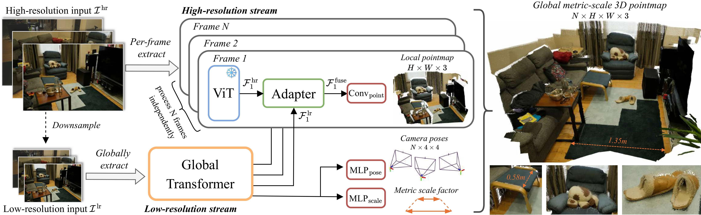

<h1 align="center">DAGE: Dual-Stream Architecture for Efficient and Fine-Grained Geometry Estimation</h1>

<div align="center">
    <p>
        <a href="https://ngoductuanlhp.github.io/">Tuan Duc Ngo</a><sup>1</sup>&nbsp;&nbsp;
        <a href="https://gabriel-huang.github.io/">Jiahui Huang</a><sup>2</sup>&nbsp;&nbsp;
        <a href="https://sites.google.com/view/seoungwugoh/">Seoung Wug Oh</a><sup>2</sup>&nbsp;&nbsp;
        <a href="https://www.kmatzen.com/">Kevin Blackburn-Matzen</a><sup>2</sup>&nbsp;&nbsp;
        <br>
        <a href="https://kalo-ai.github.io/">Evangelos Kalogerakis</a><sup>1,3</sup>&nbsp;&nbsp;
        <a href="https://people.csail.mit.edu/ganchuang/">Chuang Gan</a><sup>1</sup>&nbsp;&nbsp;
        <a href="https://joonyoung-cv.github.io/">Joon-Young Lee</a><sup>2</sup>
    </p>
    <p>
        <sup>1</sup>UMass Amherst &nbsp;&nbsp;&nbsp;
        <sup>2</sup>Adobe Research &nbsp;&nbsp;&nbsp;
        <sup>3</sup>TU Crete
    </p>
    <p>
        <strong>CVPR 2026</strong>
    </p>
</div>

<p align="center">
    <a href="https://arxiv.org/abs/2603.03744" target="_blank">
    
    </a>
    <a href="https://ngoductuanlhp.github.io/dage-site/" target="_blank">
    
    </a>
</p>


<div align="center">
    <a href="https://ngoductuanlhp.github.io/dage-site/">
        
    </a>
    <p>
        <i>DAGE delivers accurate and consistent 3D geometry, fine-grained and high-resolution depthmaps, while maintaining efficiency and scalability.</i>
    </p>
</div>

## 🧭 Overview

DAGE is a dual-stream transformer that disentangles **global coherence** from **fine detail** for geometry estimation from uncalibrated multi-view/video inputs.

- **LR stream** builds view-consistent representations and estimates cameras efficiently.
- **HR stream** preserves sharp boundaries and fine structures per-frame.
- **Lightweight adapter** fuses the two via cross-attention without disturbing the pretrained single-frame pathway.
- Scales resolution and clip length independently, supports inputs up to 2K, and achieves state-of-the-art on video geometry estimation and multi-view reconstruction.


## 📢 Updates
* [Mar, 2026] Initial release with inference, training code and model checkpoint.


## 🚀 Quick Start

### 🛠️ 1. Clone & Install Dependencies

```bash
git clone https://github.com/ngoductuanlhp/DAGE.git
cd DAGE

bash scripts/instal_env.sh
conda activate dage
```

This creates a conda environment with Python 3.10, PyTorch 2.10.0 (CUDA 13.0), and all required dependencies.


### 🎬 2. Run Inference

Run on the included demo data or your own video/image folder:

```bash
# Run with default settings on demo data
bash demo.sh

# Or run directly with custom arguments

# Default: LR at 252px, HR at 3600 tokens (~840x840 for square images)
python inference/infer_dage.py --checkpoint TuanNgo/DAGE

# Higher LR resolution (better camera poses, more compute)
python inference/infer_dage.py --checkpoint TuanNgo/DAGE --lr_max_size 518

# Higher HR resolution up to 2K (sharper pointmaps)
python inference/infer_dage.py --checkpoint TuanNgo/DAGE --hr_max_size 1920

# Memory-efficient chunking for GPUs with <40GB VRAM (lower chunk_size if OOM)
python inference/infer_dage.py --checkpoint TuanNgo/DAGE --hr_max_size 1920 --chunk_size 8
```

**Arguments:**

| Argument | Default | Description |
| :--- | :--- | :--- |
| `--checkpoint` | `TuanNgo/DAGE` | Path to model checkpoint |
| `--output_dir` | `quali_results/dage` | Directory to save results |
| `--lr_max_size` | `252` | Max resolution for the LR stream |
| `--hr_max_size` | `None` | Max resolution for the HR stream (auto-computed from 3600 tokens if not set) |
| `--chunk_size` | `None` | Chunk size for HR stream (enables memory-efficient chunked inference) |

**Input**: Place videos (`.mp4`, `.MOV`) or image folders in `assets/demo_data/`.

**Output**: For each input, the script saves:
- `<name>_disp_colored.mp4` — colorized disparity video
- `<name>_depth_colored.mp4` — colorized depth video
- `<name>.npy` — dictionary with `pointmap`, `pointmap_global`, `pointmap_mask`, `rgb`, and `extrinsics`

### 🤗 3. Model Checkpoints

Our checkpoint is available at 🤗 Hugging Face Hub: [TuanNgo/DAGE](https://huggingface.co/TuanNgo/DAGE)

Or you can manually download the checkpoint and place it in the `checkpoints/` directory:

```bash
mkdir -p checkpoints

gdown --fuzzy https://drive.google.com/file/d/1BsBJ7MTarlBP5RjCVfPQoQMsCxccBabF/view?usp=sharing -O ./checkpoints/
```


## 📘 Detailed Usage

### 🔄 Model Input & Output

* **Input**: `torch.Tensor` of shape `(B, N, 3, H, W)` with pixel values in `[0, 1]`.
* **Output**: A `dict` with the following keys:

| Key | Shape | Description |
| :--- | :--- | :--- |
| `local_points` | `(B, N, H, W, 3)` | Per-view 3D point maps in local camera space |
| `conf` | `(B, N, H, W, 1)` | Confidence logits (apply `torch.sigmoid()` for probabilities) |
| `camera_poses` | `(B, N, 4, 4)` | Camera-to-world transformation matrices (OpenCV convention) |
| `metric_scale` | `(B, 1)` | Predicted metric scale factor |
| `global_points` | `(B, N, H, W, 3)` | 3D points in world space (after `infer()`) |
| `mask` | `(B, N, H, W)` | Binary confidence mask (after `infer()`) |

### 💡 Example Code Snippet

```python
import torch
from einops import rearrange

from dage.models.dage import DAGE
from dage.utils.data_utils import read_video, resize_to_max_side

# --- Setup ---
device = 'cuda'
model = DAGE.from_pretrained('checkpoints/model.pt').to(device).eval()

# --- Load Data ---
# read_video returns (frames, H, W, fps)
# Options: stride=N, max_frames=N, force_num_frames=N
video, H, W, fps = read_video('path/to/video.mp4', stride=10, max_frames=100)

# Prepare tensors (B, N, C, H, W), values in [0, 1]

lr_max_size = 252
hr_max_size = 518 # or 1022 / 1918

lr_video, lr_height, lr_width = resize_to_max_side(video, lr_max_size)
hr_video, hr_height, hr_width = resize_to_max_side(video, hr_max_size)  
hr_num_tokens = (hr_height // 14) * (hr_width // 14)

lr_video = rearrange(torch.from_numpy(lr_video), 't h w c -> 1 t c h w').float().to(device) / 255.0
hr_video = rearrange(torch.from_numpy(hr_video), 't h w c -> 1 t c h w').float().to(device) / 255.0

# --- Inference ---
with torch.no_grad():
    output = model.infer(
        hr_video=hr_video,
        lr_video=lr_video,
        lr_max_size=lr_max_size,
        hr_num_tokens=hr_num_tokens,
        chunk_size=None,  # optional, for memory efficiency
    )

# Access outputs
local_points = output['local_points']   # (N, H, W, 3)
global_points = output['global_points'] # (N, H, W, 3)
camera_poses = output['camera_poses']   # (N, 4, 4)
mask = output['mask']                   # (N, H, W)
```

### 📐 Resolution Handling

Both streams require resolutions that are multiples of the patch size (14). The HR stream defaults to 3600 tokens total (e.g., 840x840 for square images, 630x1120 for 9:16), but can be overridden with `--hr_max_size`.


## 👀 Visualization

We use [viser](https://github.com/nerfstudio-project/viser) for interactive 3D point cloud visualization. The inference script saves `.npy` files that can be directly visualized.

**Dynamic scenes** — renders pointmaps sequentially with playback controls (timestep slider, play/pause, FPS control):

```bash
python visualization/vis_pointmaps.py --data_path quali_results/dage/<name>.npy
```

**Static scenes** — merges all frames into a single point cloud in a shared coordinate frame:

```bash
python visualization/vis_pointmaps_all.py --data_path quali_results/dage/<name>.npy
```

Both scripts launch a viser server (default port `7891`) accessible via browser. Common options:

| Argument | Default | Description |
| :--- | :--- | :--- |
| `--downsample_ratio` | `2` | Spatial downsampling for faster rendering |
| `--point_size` | `0.002` / `0.01` | Point size in the viewer |
| `--scale_factor` | `1.0` | Scale the point cloud |
| `--sample_num` | all | Uniformly sample N frames |
| `--port` | `7891` | Viser server port |


## 🎓 Training

See [docs/TRAINING.md](docs/TRAINING.md) for detailed instructions on data preparation, loss functions, and configuration.


## 📊 Evaluation

See [docs/EVALUATION.md](docs/EVALUATION.md) for detailed instructions.


## 🗂️ Project Structure

```
DAGE/
├── assets/
│   └── demo_data/                  # Demo videos for inference
├── configs/
│   └── model_config_dage.yaml      # Model architecture config
├── dage/                           # Main package
│   ├── models/
│   │   ├── dage.py                 # DAGE model
│   │   ├── dinov2/                 # DINOv2 backbone
│   │   ├── layers/                 # Transformer blocks, attention, camera head
│   │   └── moge/                   # MoGe encoder components
│   └── utils/                      # Geometry, visualization, data loading
├── evaluation/                     # Benchmark evaluation
├── inference/
│   └── infer_dage.py               # Main inference script
├── scripts/
│   ├── eval/                       # Evaluation bash scripts
│   ├── infer/                      # Inference bash scripts
│   └── instal_env.sh               # Environment setup
├── setup.py
├── third_party/                    # Code for related work (VGGT, Pi3, Cut3r, etc)
└── training/
    ├── dataloaders/                # Video dataloaders & dataset configs
    ├── loss/                       # Loss functions
    ├── train_dage_stage{1,2,3}.py  # Three-stage training scripts
    └── training_configs/           # YAML configs for trainings
```


## 🙏 Acknowledgements

Our work builds upon several open-source projects:

* [DUSt3R](https://github.com/naver/dust3r)
* [Pi3](https://github.com/yyfz/Pi3)
* [MoGe](https://github.com/microsoft/MoGe)
* [VGGT](https://github.com/facebookresearch/vggt)
* [DINOv2](https://github.com/facebookresearch/dinov2)


## 📝 Citation

If you find our work useful, please consider citing:

```bibtex
@inproceedings{ngo2026dage,
  title={DAGE: Dual-Stream Architecture for Efficient and Fine-Grained Geometry Estimation},
  author={Ngo, Tuan Duc and Huang, Jiahui and Oh, Seoung Wug and Blackburn-Matzen, Kevin and Kalogerakis, Evangelos and Gan, Chuang and Lee, Joon-Young},
  booktitle={Proceedings of the IEEE/CVF Conference on Computer Vision and Pattern Recognition (CVPR)},
  year={2026}
}
```


## ⚖️ License

The code in this repository is released under the [CC BY-NC 4.0](https://creativecommons.org/licenses/by-nc/4.0/) license, unless otherwise specified.